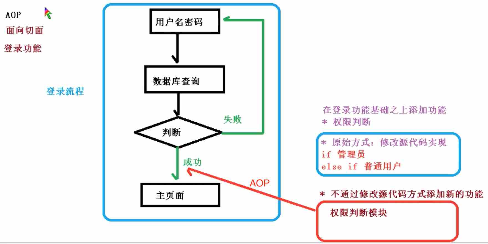
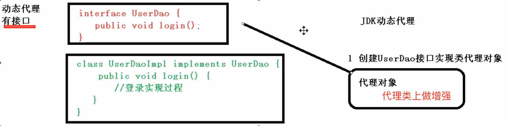
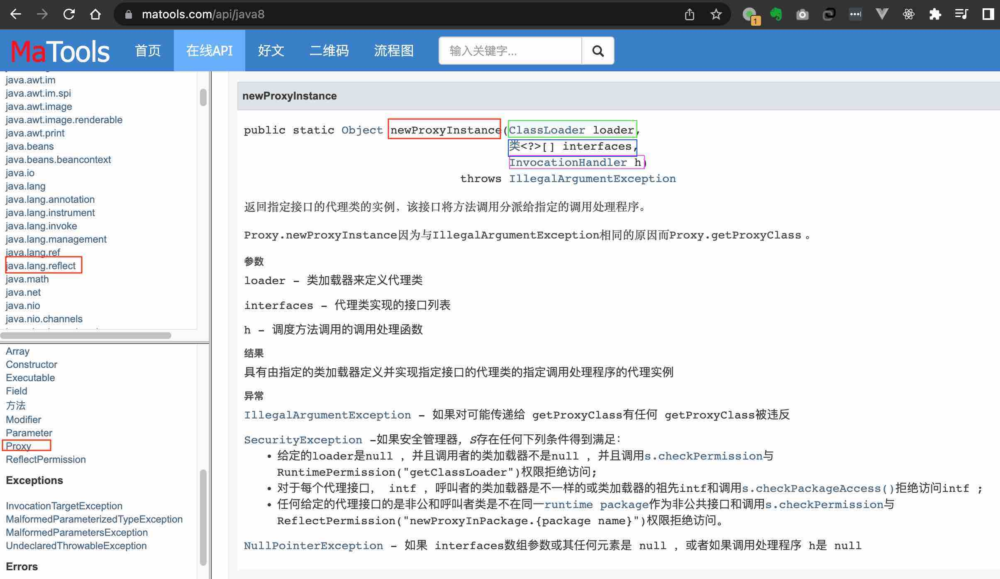

### AOP（概念）

1、什么是AOP？
	1）面向切面编程，利用AOP可以对业务逻辑的各个部分进行隔离，从而使得业务逻辑各部分之间的耦合度降低，提高程序的可重用性，同事提高了开发效率。

	2）通俗描述：不通过修改源代码方式，在猪肝功能里面添加新功能

### AOP（底层原理）

1、AOP底层原理使用动态代理
	1）有两种情况动态代理
		第一种 **有接口**情况，使用**JDK动态代理**
			a）创建UserDao接口实现类代理对象
			b）通过代理对象来实现类的增强

​		第二种 **没有接口**情况，使用**CGLIB动态代理**
​			a）创建当前类子类代理对象
​			b）通过子类代理对象来实现类的增强

### AOP（JDK动态代理）

1、使用JDK动态代理，使用Proxy类里面的方法创建代理对象
	*JAVA 8 API - java.lang.reflect.Proxy类：https://www.matools.com/api/java8

	1）调用newProxyInstance方法
		a）第一个参数：类加载器
		b）第二个参数：增强方法所在的类所实现接口（一个或多个）
		c）第三个参数：实现这个接口InvocationHandler，创建代理对象，写增强的方法

2、编写JDK动态代理代码

