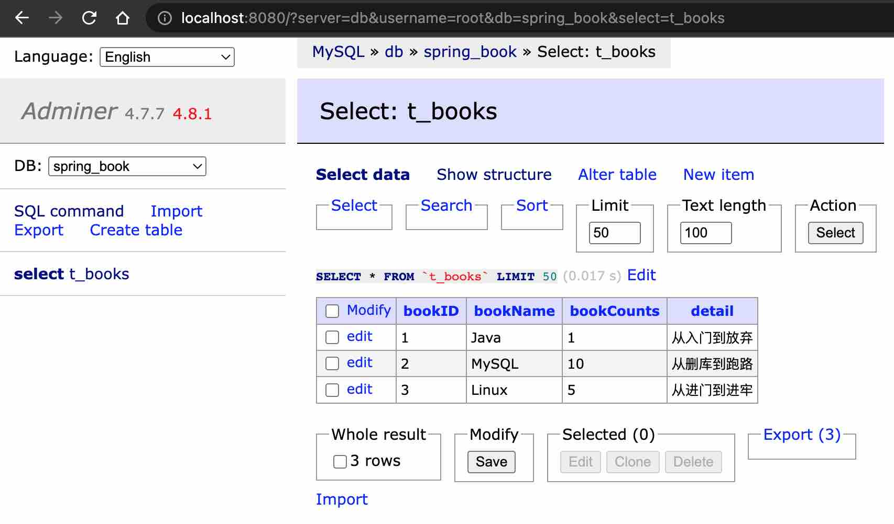
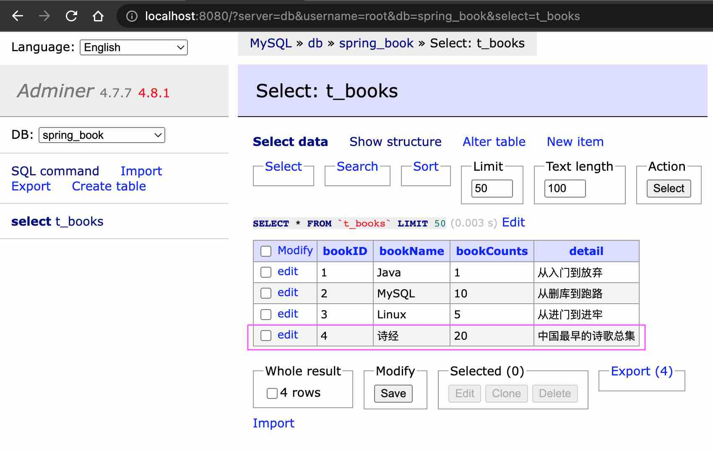

### JdbcTemplate 概念及配置准备工作

1、什么是JdbcTemplate
	1）Spring框架对JDBC进行封装，使用JdbcTemplate方便实现对数据库操作

2、准备工作
	1）引入依赖

```xml
<!--spring jdbc、tx、orm的依赖-->
<dependency>
  <groupId>org.springframework</groupId>
  <artifactId>spring-jdbc</artifactId>
  <version>5.3.3</version>
</dependency>
<dependency>
  <groupId>org.springframework</groupId>
  <artifactId>spring-tx</artifactId>
  <version>5.3.3</version>
</dependency>
<dependency>
  <groupId>org.springframework</groupId>
  <artifactId>spring-orm</artifactId>
  <version>5.3.3</version>
</dependency>
<!--数据库连接池druid-->
<dependency>
  <groupId>com.alibaba</groupId>
  <artifactId>druid</artifactId>
  <version>1.1.10</version>
</dependency>
<!--数据库驱动-->
<dependency>
  <groupId>mysql</groupId>
  <artifactId>mysql-connector-java</artifactId>
  <version>8.0.21</version>
</dependency>
```

​	2）在spring配置文件配置数据库连接池

```properties
# 驱动类路径名和URL配置专为mysql:8.0.21版本使用
jdbc.driverClassName=com.mysql.cj.jdbc.Driver
jdbc.url=jdbc:mysql://localhost:3306/spring_book?useSSL=true&useUnicode=true&characterEncoding=utf-8&serverTimezone=Asia/Shanghai
jdbc.username=root
jdbc.password=123456
```

```xml
<!--数据库连接池-->
<context:property-placeholder location="classpath:jdbc.properties"/>
<bean id="dataSource" class="com.alibaba.druid.pool.DruidDataSource">
  <property name="driverClassName" value="${jdbc.driverClassName}"/>
  <property name="url" value="${jdbc.url}"/>
  <property name="username" value="${jdbc.username}"/>
  <property name="password" value="${jdbc.password}"/>
</bean>
```

​	3）配置JdbcTemplate对象，注入DataSource

```xml
<!--配置JdbcTemplate对象，注入DataSource-->
<bean id="jdbcTemplate" class="org.springframework.jdbc.core.JdbcTemplate">
  <property name="dataSource" ref="dataSource"/>
</bean>
```

​	4）创建service类，创建dao类；在service类里注入dao，在dao类注入jdbcTemplate对象

```xml
<!--开启组件扫描-->
<context:component-scan base-package="com.atguigu.spring5.jdbctemplate"/>
```

```java
public interface BookDao {
}

@Repository
public class BookDaoImpl implements BookDao {

    // dao类里注入JdbcTemplate
    @Autowired
    private JdbcTemplate jdbcTemplate;
}

@Service
public class BookService {

    // service类里注入dao
    @Autowired
    private BookDao bookDao;
}
```

​	5）创建数据库 - 这里使用docker-compose创建，admier在8080端口方便网页版连接数据库

```yaml
# Use root/123456 as user/password credentials
version: '3.1'

services:

  db:
    image: mysql:8.0.21
    container_name: ms.dev
    command: --default-authentication-plugin=mysql_native_password
    restart: always
    environment:
      MYSQL_ROOT_PASSWORD: 123456
      MYSQL_DATABASE: spring_book

    # security_opt:
      # - seccomp:unconfined
    cap_add: [ SYS_NICE ]
    ports:
      - 3306:3306

  adminer:
    image: adminer
    restart: always
    # links:
     # - mysql
    ports:
      - 8080:8080
```

​	6）创建数据库表

```mssql
CREATE DATABASE spring_book;
USE spring_book;
CREATE TABLE `t_books`
(
    `bookID`     INT          NOT NULL AUTO_INCREMENT COMMENT '书id',
    `bookName`   VARCHAR(100) NOT NULL COMMENT '书名',
    `bookCounts` INT          NOT NULL COMMENT '数量',
    `detail`     VARCHAR(200) NOT NULL COMMENT '描述',
    KEY `bookID` (`bookID`)
) ENGINE = INNODB
  DEFAULT CHARSET = utf8;

INSERT INTO `t_books`(`bookID`, `bookName`, `bookCounts`, `detail`)
VALUES (1, 'Java', 1, '从入门到放弃'),
       (2, 'MySQL', 10, '从删库到跑路'),
       (3, 'Linux', 5, '从进门到进牢'); 
```




### JdbcTemplate操作数据库（添加）

1、对应数据库表创建实体类

```java
public class Books {

    private int bookID;
    private String bookName;
    private int bookCounts;
    private String detail;

    public int getBookID() {
        return bookID;
    }

    public void setBookID(int bookID) {
        this.bookID = bookID;
    }

    public String getBookName() {
        return bookName;
    }

    public void setBookName(String bookName) {
        this.bookName = bookName;
    }

    public int getBookCounts() {
        return bookCounts;
    }

    public void setBookCounts(int bookCounts) {
        this.bookCounts = bookCounts;
    }

    public String getDetail() {
        return detail;
    }

    public void setDetail(String detail) {
        this.detail = detail;
    }
}
```

2、编写service和dao
	1）在dao进行数据库添加操作
	2）调用JdbcTemplate对象里面update方法实现添加操作

```plain/text
update方法：update(String sql, Object... args)
第一个参数：sql语句
第二个参数：可变参数，设置sql语句值
```

 ```java
@Service
public class BookService {

    // service类里注入dao
    @Autowired
    private BookDao bookDao;

    // 添加的方法
    public void addBook(Books books) {
        bookDao.add(books);
    }
}

public interface BookDao {
    // 添加书籍
    void add(Books books);
}

@Repository
public class BookDaoImpl implements BookDao {

    // dao类里注入JdbcTemplate
    @Autowired
    private JdbcTemplate jdbcTemplate;

    // 添加书籍
    public void add(Books books) {
        // 1. 创建sql语句, ?表示占位符，可被jdbcTemplate参数形式替换
        String sql = "INSERT INTO spring_book.t_books (bookName, bookCounts, detail) VALUE (?,?,?)";

        // 2。 调用方法实现，返回影响行数
        // 写法1.
//        int update = jdbcTemplate.update(sql, books.getBookName(), books.getBookCounts(), books.getDetail());

        // 写法2.
        Object[] args = {books.getBookName(), books.getBookCounts(), books.getDetail()};
        int update = jdbcTemplate.update(sql, args);

        System.out.println(update);
    }
}
 ```

3、测试类

```java
public class TestJdbcTemplate {

    @Test
    public void testJdbcTemplate() {
        ApplicationContext context = new ClassPathXmlApplicationContext("spring-jdbctemplate.xml");
        BookService bookService = context.getBean("bookService", BookService.class);
        Books books = new Books();
        books.setBookName("诗经");
        books.setBookCounts(20);
        books.setDetail("中国最早的诗歌总集");
        bookService.addBook(books);
    }
}
```

​	Output:

```plain/text
1
Tests run: 1, Failures: 0, Errors: 0, Skipped: 0, Time elapsed: 2.288 sec
```

4、查看数据库插入更新的结果




