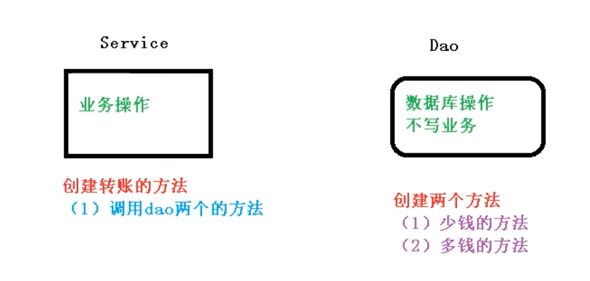
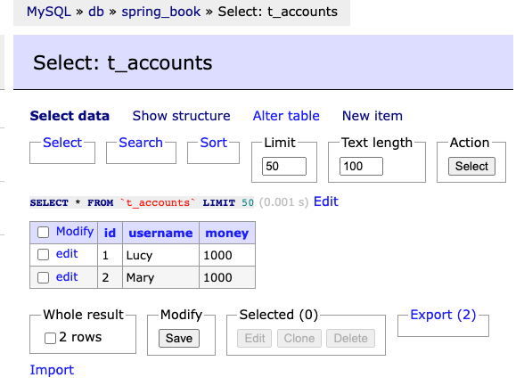
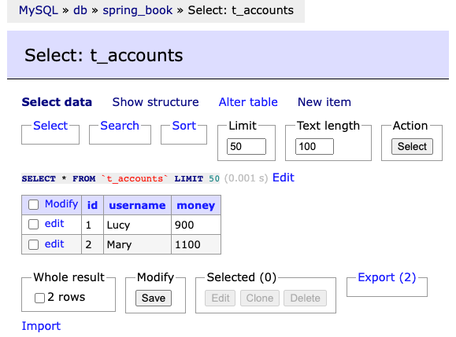

### 事务概念

1、什么是事务
	1）事务是数据库操作的最基本单元，逻辑上一组操作，要么都成功，如果有一个失败所有操作都失败
	2）典型场景：银行转账
		Lucy转账100元给Mary，两个步骤：1）Lucy少100元；2）Mary多100元，若其中一个步骤失败，则整体操作都是失败，若都成功，则成功

2、事务的四个特性（ACID）（More on https://zhuanlan.zhihu.com/p/98465611)
1）原子性（Atomicity）- 原子性是指事务是一个不可分割的工作单位，事务中的操作要么全部成功，要么全部失败。
	同一个事务中的SQL语句，要么全部执行成功，要么全部执行失败。

```sql
begin transaction;
    update account set money = money-100 where name = '张三';
    update account set money = money+100 where name = '李四';
commit transaction;
```

2）一致性（Consistency）- 事务必须使数据库从一个一致性状态变换到另外一个一致性状态。
	换一种方式理解就是：事务按照预期生效，数据的状态是预期的状态。
	举例说明：张三向李四转100元，转账前和转账后的数据是正确的状态，这就叫一致性，如果出现张三转出100元，李四账号没有增加100元这就出现了数据错误，就没有达到一致性。

3）隔离性（Isolation）- 事务的隔离性是多个用户并发访问数据库时，数据库为每一个用户开启的事务，不能被其他事务的操作数据所干扰，多个并发事务之间要相互隔离。

4）持久性（Durability）- 持久性是指一个事务一旦被提交，它对数据库中数据的改变就是永久性的，接下来即使数据库发生故障也不应该对其有任何影响。
	例如我们在使用JDBC操作数据库时，在提交事务方法后，提示用户事务操作完成，当我们程序执行完成直到看到提示后，就可以认定事务已经正确提交，即使这时候数据库出现了问题，也必须要将我们的事务完全执行完成，否则就会造成我们看到提示事务处理完毕，但是数据库因为故障而没有执行事务的重大错误。


### 事务操作（搭建事务操作环境）



1、创建数据库表，添加记录

```sql
CREATE TABLE `t_accounts` (
  `id` varchar(20) NOT NULL,
  `username` varchar(50) DEFAULT NULL,
  `money` int NOT NULL
) ENGINE=InnoDB DEFAULT CHARSET=utf8mb4 COLLATE=utf8mb4_0900_ai_ci;

INSERT INTO `t_accounts` (`id`, `username`, `money`) VALUES
('1',	'Lucy',	1000),
('2',	'Mary',	1000);
```



2、创建service，dao，完成对象创建和注入关系
1）配置spring，开启自动扫描，创建数据库连接DataSource，JdbcTemplate，在JdbcTemplate中注入DataSource

```proper
# 注意如下配置对应版本为Mysql 8.0.21
jdbc.driverClassName=com.mysql.cj.jdbc.Driver
jdbc.url=jdbc:mysql://localhost:3306/spring_book?useSSL=true&useUnicode=true&characterEncoding=utf-8&serverTimezone=Asia/Shanghai
jdbc.username=root
jdbc.password=123456
```

```xml
<!--开启组件扫描-->
<context:component-scan base-package="com.atguigu.spring5"/>

<!--数据库连接池-->
<context:property-placeholder location="classpath:jdbc.properties"/>
<bean id="dataSource" class="com.alibaba.druid.pool.DruidDataSource">
  <property name="driverClassName" value="${jdbc.driverClassName}"/>
  <property name="url" value="${jdbc.url}"/>
  <property name="username" value="${jdbc.username}"/>
  <property name="password" value="${jdbc.password}"/>
</bean>

<!--配置JdbcTemplate对象，注入DataSource-->
<bean id="jdbcTemplate" class="org.springframework.jdbc.core.JdbcTemplate">
  <property name="dataSource" ref="dataSource"/>
</bean>
```

2）service注入dao，在dao注入JdbcTemplate，在JdbcTemplate中注入DataSource

```java
@Service
public class UserService {
    // 注入dao
    @Autowired
    private UserDao userDao;
}

public interface UserDao {
}

@Repository
public class UserDaoImpl implements UserDao {
    @Autowired
    private JdbcTemplate jdbcTemplate;
}
```

3）在dao创建两个方法：多钱和少钱的方法，在service创建转账的方法

```java
public interface UserDao {
    void addMoney();
    void reduceMoney();
}


@Repository
public class UserDaoImpl implements UserDao {

    @Autowired
    private JdbcTemplate jdbcTemplate;

    // 多钱的方法: Mary收到Lucy转过来的100
    public void addMoney() {
        String sql = "UPDATE t_accounts SET money=money+? where username=?";
        jdbcTemplate.update(sql, 100, "Mary");
    }


    // 少钱的方法: Lucy转账100给Mary
    public void reduceMoney() {
        String sql = "UPDATE t_accounts SET money=money-? where username=?";
        jdbcTemplate.update(sql, 100, "Lucy");
    }
}


@Service
public class UserService {

    // 注入dao
    @Autowired
    private UserDao userDao;

    // Lucy给Mary转账的方法
    public void moveMoney() {
        // Lucy少100
        userDao.reduceMoney();

        // Mary多100
        userDao.addMoney();
    }

}
```

4）测试执行，查看成功结果，完成基础环境搭建，为后续使用事务铺垫

```java
public class TestTransactional {
    @Test
    public void testTransactional() {
        ApplicationContext context = new ClassPathXmlApplicationContext("spring-jdbctemplate.xml");
        UserService userService = context.getBean("userService", UserService.class);
        // 完成转账的方法测试
        userService.moveMoney();
    }
}
```



