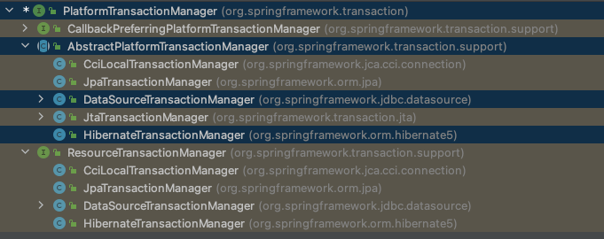
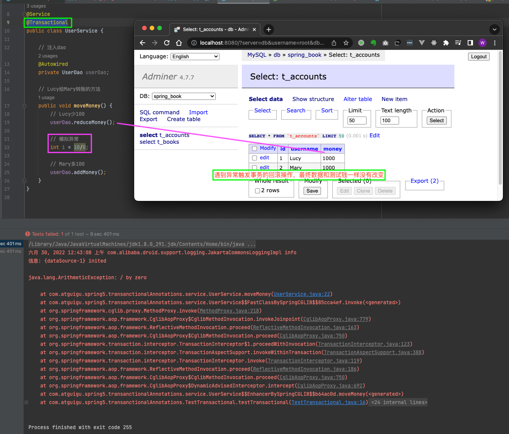
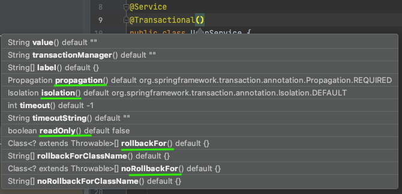
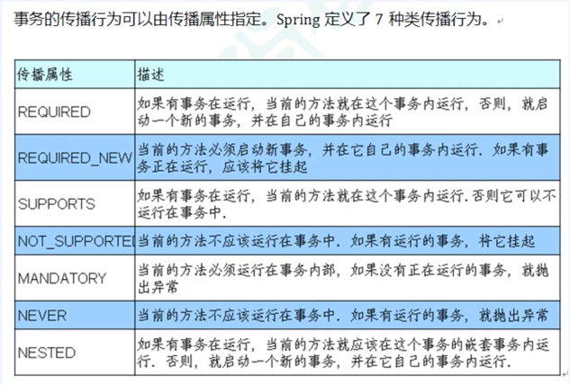
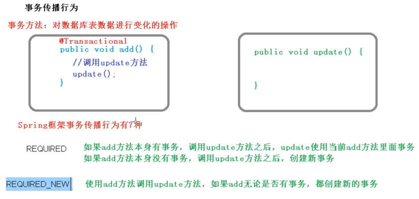
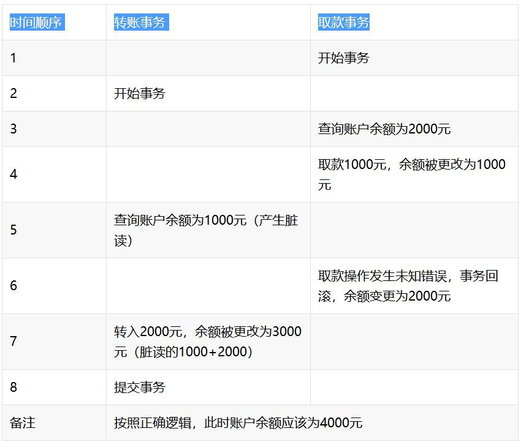
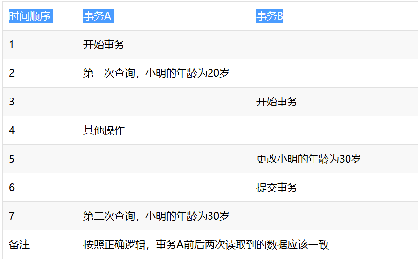
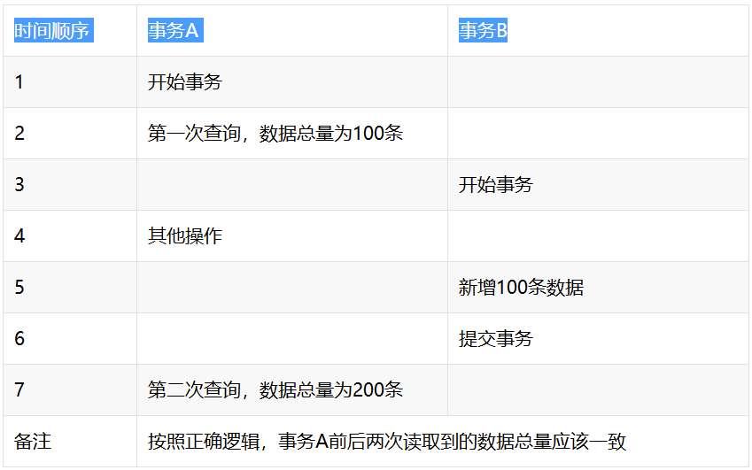
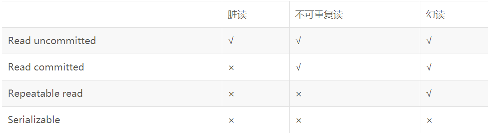

### 事务操作（Spring事务管理基本介绍）

1、一般都把事务添加到JaveEE三层结构里面的Service 层（业务逻辑层）

2、在Spring进行事务管理操作
	1）有两种方式：
	**编程式事务管理（少用）**  - 直接在service方法里面编写代码实现
    **声明式事务管理（多用）** - 通过Spring事务提供注解的配置形式实现

3、声明式事务管理
	1）基于注解方式
	2）基于xml配置文件方式

4、在Spring进行声明式事务管理，**底层使用AOP**

5、Spring事务管理API
	1）提供一个接口，代表事务管理器，这个接口针对不同的框架提供不同的实现类



### 事务操作（注解声明式事务管理）

1、在spring的配置文件中，配置事务管理器

```xml
<!--创建事务管理器-->
<bean id="transactionManager" class="org.springframework.jdbc.datasource.DataSourceTransactionManager">
  <!--注入数据源-->
  <property name="dataSource" ref="dataSource"/>
</bean>
```

2、在spring的配置文件中，开启事务注解
	1）在spring配置文件引入名称空间tx

```xml
<?xml version="1.0" encoding="UTF-8"?>
<beans xmlns="http://www.springframework.org/schema/beans"
       xmlns:xsi="http://www.w3.org/2001/XMLSchema-instance"
       xmlns:context="http://www.springframework.org/schema/context"
       xmlns:aop="http://www.springframework.org/schema/aop"
       xmlns:tx="http://www.springframework.org/schema/tx"
       xsi:schemaLocation="http://www.springframework.org/schema/beans https://www.springframework.org/schema/beans/spring-beans.xsd
                           http://www.springframework.org/schema/context https://www.springframework.org/schema/context/spring-context.xsd
                           http://www.springframework.org/schema/aop https://www.springframework.org/schema/aop/spring-aop.xsd
                           http://www.springframework.org/schema/tx https://www.springframework.org/schema/tx/spring-tx.xsd">
```

​	2）开启事务注解

```xml
<!--开启事务注解-->
<tx:annotation-driven transaction-manager="transactionManager"></tx:annotation-driven>
```

3、在service类上面（获取service类里面方法上面）添加事务注解
	1）**@Transactional**，这个注解添加到**类**上，也可以添加到**方法**上面
	*如果把@Transactional添加到类上面，这个类里面所有的方法都添加事务
	*如果把@Transactional添加到方法上面，则为该方法添加事务



### 事务操作（声明式事务管理参数配置）

1、在service类上面添加注解@Transactional，在这个注解里面可以配置事务相关参数


2、**propagations**：事务传播行为
	1）多事务方法直接进行调用，这个过程中事务时如何进行管理的





```java
//@Transactional
//@Transactional(propagation = Propagation.REQUIRED) // 默认传播行为
@Transactional(propagation = Propagation.REQUIRES_NEW)
```


3、**isolation**：事务隔离级别 （More：https://cloud.tencent.com/developer/article/1450773）
	事务有特性称为隔离性，多事务操作之间不会产生影响。
	若不考虑隔离性会产生很多问题：
	1）脏读：**读取未提交数据**，A事务读取B事务尚未提交的数据，此时如果B事务发生错误并执行回滚操作，那么A事务读取到的数据就是脏数据。
好像原本的数据比较干净、纯粹，此时由于B事务更改了它，这个数据变得不再纯粹。这个时候A事务立即读取了这个脏数据，但事务B良心发现，又用回滚把数据恢复成原来干净、纯粹的样子，而事务A却什么都不知道，最终结果就是事务A读取了此次的脏数据，称为脏读。
	2）不可重复读：**前后多次读取，数据内容不一致**，事务A在执行读取操作，由整个事务A比较大，前后读取同一条数据需要经历很长的时间 。而在事务A第一次读取数据，比如此时读取了小明的年龄为20岁，事务B执行更改操作，将小明的年龄更改为30岁，此时事务A第二次读取到小明的年龄时，发现其年龄是30岁，和之前的数据不一样了，也就是数据不重复了，系统不可以读取到重复的数据，成为不可重复读。

	3）虚（幻）读：**前后多次读取，数据总量不一致**，事务A在执行读取操作，需要两次统计数据的总量，前一次查询数据总量后，此时事务B执行了新增数据的操作并提交后，这个时候事务A读取的数据总量和之前统计的不一样，就像产生了幻觉一样，平白无故的多了几条数据，成为幻读。


**不可重复读和幻读到底有什么区别呢？**
	1) 不可重复读是读取了其他事务更改的数据，**针对update操作**
解决：使用行级锁，锁定该行，事务A多次读取操作完成后才释放该锁，这个时候才允许其他事务更改刚才的数据。
	2) 幻读是读取了其他事务新增的数据，**针对insert和delete操作**
解决：使用表级锁，锁定整张表，事务A多次读取数据总量之后才释放该锁，这个时候才允许其他事务新增数据。
这时候再理解事务隔离级别就简单多了呢。

**数据库的隔离级别**
	数据库事务的隔离级别有4个，由低到高依次为**Read uncommitted(读未提交) 、Read committed(读已提交) 、Repeatable read(可重复读) 、Serializable(可重复读)** ，这四个级别可以逐个解决脏读 、不可重复读 、幻读 这几类问题。


```java
//@Transactional(isolation = Isolation.READ_UNCOMMITTED)
//@Transactional(isolation = Isolation.READ_COMMITTED)
//@Transactional(isolation = Isolation.REPEATABLE_READ)
@Transactional(isolation = Isolation.SERIALIZABLE)
```

4、**timeout**：超时
	1）事务需要在一定时间内进行提交，如果不提交则进行回滚
	2）默认值是-1，表示永不超时。设置时间以妙为单位进行计算

```java
//@Transactional(timeout = -1)
@Transactional(timeout = 10)
```

5、**readOnly**：是否只读
	1）读：查询操作；写：添加修改删除操作
	2）readOnly默认值false，表示可以CRUD操作
	3）readOnly设置成true，则只能查询操作

```java
//@Transactional(readOnly = true) // 默认值
@Transactional(readOnly = false)
```

6、**roobackFor**：回滚
	1）设置出现哪些异常进行事务回滚

```java
@Transactional(rollbackFor = ArithmeticException.class)
```

7、**noRollbackFor**：不回滚
	1）设置出现哪些异常不进行事务回滚

```java
@Transactional(noRollbackFor = ArithmeticException.class)
```

8、总结：多个默认值一块写法

```java
@Transactional(propagation = Propagation.REQUIRED, isolation = Isolation.REPEATABLE_READ, timeout = -1, readOnly = false) // 多个默认值一起写的写法
```

