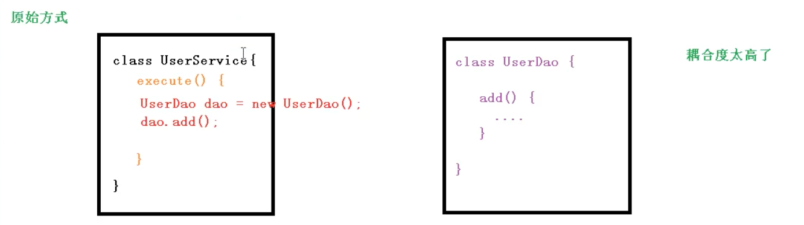
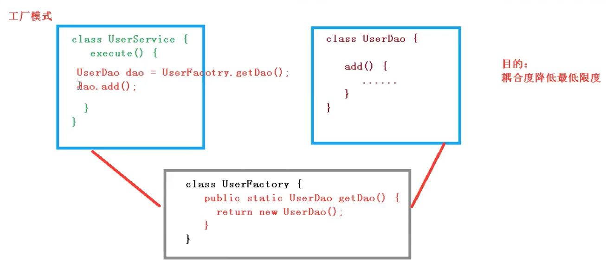
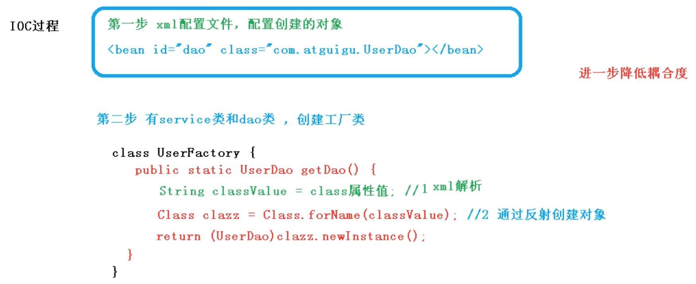
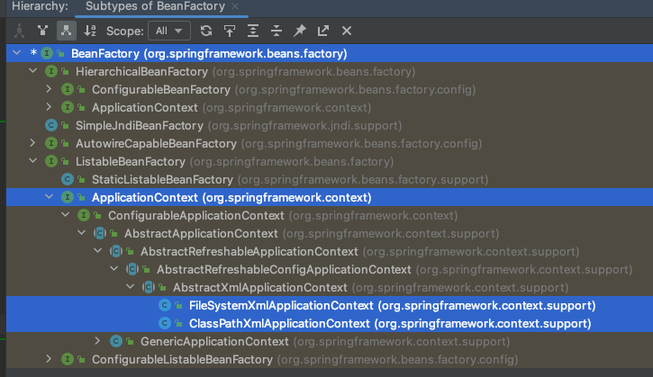

### IOC(概念和原理)
1、 什么是IOC
- 控制反转，把对象创建和对象志坚的调用过程，交给Spring进行管理
- 使用IOC目的，为了耦合度降低
- 做入门案例IOC实现

2、IOC底层原理

- xml解析、工厂模式、反射

3、画图讲解IOC底层原理

### IOC（接口）

1、IOC思想基于IOC容器完成，IOC容器底层就是对象工厂

2、Spring提供IOC容器是想两种方式：（两个接口）

​	1） BeanFactory：IOC容器基本实现，是Spring内部的使用接口，不提供开发人员进行使用
​		*加载配置文件时候不会创建对象，在获取对象（使用）时才会创建对象

> BeanFactory context = new ClassPathXmlApplicationContext("spring.xml"); 

​	2） ApplicationContext：BeanFactory接口的字接口，提供更多强大的功能，一般由开发人员进行使用
​		*加载配置文件的时候就会提前根据配置文件对象进行创建

> ApplicationContext context = new ClassPathXmlApplicationContext("spring.xml");

3、ApplicationContext接口有实现类

