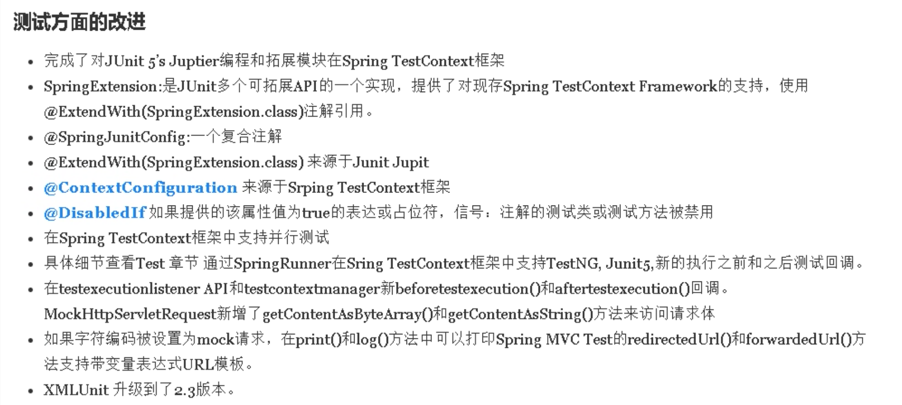

### Spring 5框架新功能

1、整个Spring5框架代码基于Java8，运行时兼容JDK9，许多不建议使用的类和方法在代码库中删除。

2、Spring5框架**自带了通用的日志封装**
	1）Spring5已经移除了Log4jConfigListener，官方建议使用Log4j2
	2）**Spring5框架整合log4j2**
	第一步，引入jar包依赖

```xml
<!--log4j相关包-->
<dependency>
  <groupId>org.apache.logging.log4j</groupId>
  <artifactId>log4j-api</artifactId>
  <version>2.13.3</version>
</dependency>
<dependency>
  <groupId>org.apache.logging.log4j</groupId>
  <artifactId>log4j-core</artifactId>
  <version>2.13.3</version>
</dependency>
<dependency>
  <groupId>org.apache.logging.log4j</groupId>
  <artifactId>log4j-slf4j-impl</artifactId>
  <version>2.13.3</version>
</dependency>
```

​	第二步 创建log4j2.xml配置文件，类名必须为“log4j2.xml”

```xml
<?xml version="1.0" encoding="UTF-8"?>
<Configuration status="INFO">
    <Appenders>
        <Console name="Console" target="SYSTEM_OUT">
            <PatternLayout pattern="%d{HH:mm:ss.SSS} [%t] %-5level %logger{36} - %msg%n"/>
        </Console>
    </Appenders>
    <Loggers>
        <Root level="info">
            <AppenderRef ref="Console"/>
        </Root>
    </Loggers>
</Configuration>
```

​	第三步 测试类使用

```java
public class UserTest {

    public static final Logger LOGGER = LoggerFactory.getLogger(UserTest.class);

    @Test
    public void testAdd() {
        ApplicationContext context = new ClassPathXmlApplicationContext("spring.xml");
        User user = context.getBean("user", User.class);
        System.out.println("1 -- " + user.toString());
        LOGGER.info("2 -- " + user.toString());
        LOGGER.info("Hello log4j2");
        LOGGER.warn("Hello log4j2");
        user.add();
    }
}
```

3、Spring5框架核心容器**支持@Nullable注解**
	1）@Nullable注解可以使用在**方法**上面，**属性**上面，**参数**上面，表示值可以为空

```java
public interface ApplicationContext extends EnvironmentCapable, ListableBeanFactory, HierarchicalBeanFactory, MessageSource, ApplicationEventPublisher, ResourcePatternResolver {
    @Nullable
    String getId(); // 案例1 - 属性值可以为空

    String getApplicationName();

    String getDisplayName();

    long getStartupDate();

    @Nullable
    ApplicationContext getParent(); // 案例2 - 方法返回值可以为空

    AutowireCapableBeanFactory getAutowireCapableBeanFactory() throws IllegalStateException;
}
```

```java
    public ClassPathXmlApplicationContext(String[] paths, Class<?> clazz, @Nullable ApplicationContext parent) throws BeansException {	// 案例3 - 方法的参数值可以为空
        super(parent);
        Assert.notNull(paths, "Path array must not be null");
        Assert.notNull(clazz, "Class argument must not be null");
        this.configResources = new Resource[paths.length];

        for(int i = 0; i < paths.length; ++i) {
            this.configResources[i] = new ClassPathResource(paths[i], clazz);
        }

        this.refresh();
    }
```

4、Spring5核心容器支持**函数式风格（GenericApplicationContext）**

```java
@Test
public void testGenericApplicationContext() {
  //Spring5核心容器支持**函数式风格（GenericApplicationContext）
  //1、创建GenericApplicationContext对象
  GenericApplicationContext genericApplicationContext = new GenericApplicationContext();
  //2、调用context的方法对象注册
  genericApplicationContext.refresh(); // 先清空

  // Option1: 不指定beanName
  genericApplicationContext.registerBean(User.class, () -> new User()); // 再注册
  // Option2：指定beanName
  genericApplicationContext.registerBean("user2", User.class, () -> new User()); // 再注册

  //3、获取在spring注册的对象
  // Option1: 不指定beanName，则需要写全路径
  User user1 = (User) genericApplicationContext.getBean("com.atguigu.spring5.newFeatures.User");
  // Option2: 指定beanName，则可以直接通过beanName获取对象
  User user2 = (User) genericApplicationContext.getBean("user2");
  System.out.println(user1);
  System.out.println(user2);
}
```

5、Spring5支持整合JUnit5



​	1）Spring5整合**JUnit4**
​	第一步 引入spring

```xml
<!--spring test依赖整合Junit-->
<dependency>
  <groupId>org.springframework</groupId>
  <artifactId>spring-test</artifactId>
  <version>5.3.3</version>
</dependency>
<dependency>
  <groupId>junit</groupId>
  <artifactId>junit</artifactId>
  <version>4.12</version>
</dependency>
```

​	第二步 创建测试类，使用注解方式完成

```java
import org.junit.Test;
import org.junit.runner.RunWith;
import org.springframework.beans.factory.annotation.Autowired;
import org.springframework.test.context.ContextConfiguration;
import org.springframework.test.context.junit4.SpringJUnit4ClassRunner;

@RunWith(SpringJUnit4ClassRunner.class) //指定单元测试框架版本
@ContextConfiguration("classpath:spring.xml") //加载配置文件
public class JTest4 {

    @Autowired  //这里可以直接注入bean对象来使用了
    private User user;

    @Test
    public void printUser() {
        System.out.println(user);
    }

}
```

​	2）Spring5整合**JUnit5**
​	第一步 引入JUnit5的依赖

```xml
<dependency>
  <groupId>org.junit.jupiter</groupId>
  <artifactId>junit-jupiter</artifactId>
  <version>5.7.2</version>
</dependency>
```

​	第二步 创建测试类，使用注解方式完成

```java
import org.junit.jupiter.api.Test;
import org.junit.jupiter.api.extension.ExtendWith;
import org.springframework.beans.factory.annotation.Autowired;
import org.springframework.test.context.ContextConfiguration;
import org.springframework.test.context.junit.jupiter.SpringExtension;

@ExtendWith(SpringExtension.class) //指定单元测试框架版本
@ContextConfiguration("classpath:spring.xml") //加载配置文件
public class JTest5 {

    @Autowired  //这里可以直接注入bean对象来使用了
    private User user;

    @Test
    public void printUser() {
        System.out.println(user);
    }

}
```

​	引申：JUnit5整合使用复合注解的写法

```java
//@ExtendWith(SpringExtension.class) //指定单元测试框架版本
//@ContextConfiguration("classpath:spring.xml") //加载配置文件
@SpringJUnitConfig(locations = "classpath:spring.xml") // 对于Junit5，可以使用一个复合注解替代上面两个注解完成整合（简写法）
public class JTest5_Simplify {

    @Autowired  //这里可以直接注入bean对象来使用了
    private User user;

    @Test
    public void printUser() {
        System.out.println(user);
    }

}
```

