### Spring 5框架新功能（WebFlux）

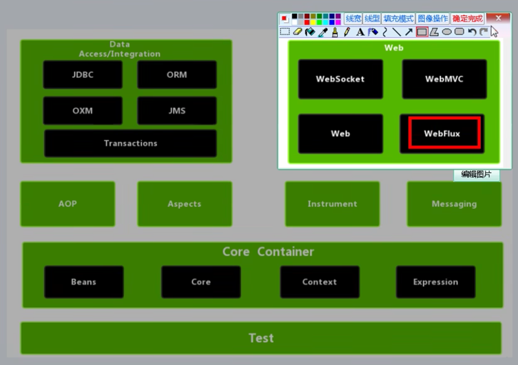

1、SpringWebFlux介绍
	*前提需要的知识：**SpringMVC、SpringBoot、Maven、Java8新特性**
	1）是Spring5添加新的模块，**用于web开发的**，功能与SpringMVC类似，但是WebFlux底层实现会有很大区别，WebFlux使用当前一种比较流行的**响应式编程**出现的框架
	2）使用传统web框架，比如SpringMVC，这些是基于Servlet容器，而WebFlux是一种**异步非阻塞的框架**，且异步非阻塞的框架在Servlet3.1后才支持，**WebFlux的核心是基于Reactor(Reactive响应式具体框架)的相关API实现的**，支持tomcat、servlet、netty等多种服务器
	3）解释什么是异步非阻塞
**异步和同步**：针对**调用者**，调用者发送请求，如果等着对方回应之后才去做其他事情就是**同步**；如果发送请求之后，不等着对方回应就去做其他事情就是**异步**。
**阻塞和非阻塞**：针对**被调用者**，被调用者接收请求，如果做完请求任务之后才给出反馈是**阻塞**；如果收到请求之后立马给出反馈，然后再去做事情就是**非阻塞**。
	4）WebFlux特点
	第一 非阻塞式：在有限资源情况下，实现更大吞吐量和伸缩性，以Reactor为基础实现响应式编程
	第二 函数式编程：Spring5框架机遇Java8，WebFlux使用Java8函数式编程方式实现路由请求
	5）WebFlux与SpringMVC比较
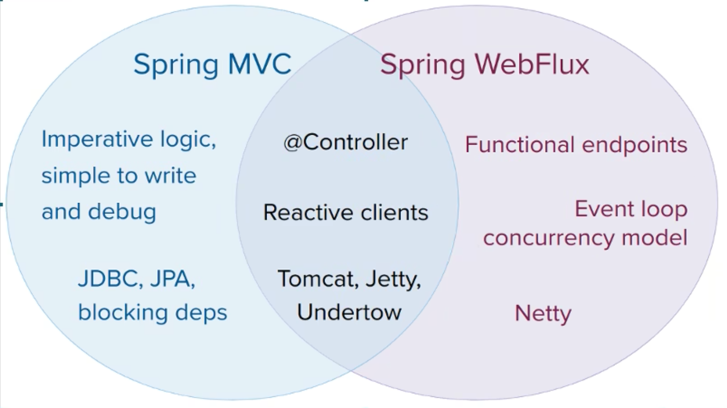
	第一：两个框架都可以使用注解方式，都运行在Tomcat等容器中
	第二：SpringMVC采用**命令式编程**，WebFlux采用**异步响应式编程**
总结：WebFlux适合于用作网关服务，在有限资源下处理更多请求

2、响应式编程
	1）什么是响应式编程
	响应式编程（Reactive Programming：RP）是一种**面向数据流**和**变化传播**的编程范式。这意味着可以在编程语言中很方便地表达**静态**或**动态**数据流，而相关的计算模型会自动将变化的值通过数据流进行传播。例如：电子表格函数使用就是一个例子。
	2）实现方式 - **Java8及其之前版本**使用观察者模式两个类：**Observer**和**Observable**

```java
public class ObserverDemoJava8Lower extends Observable {

    public static void main(String[] args) {
        ObserverDemoJava8Lower observer = new ObserverDemoJava8Lower();

        //添加观察者1
        observer.addObserver((o, arg) -> {
            System.out.println("观察者1 - 收到变化通知");
        });
        //添加观察者2 -- 注意有多个观察者，则会倒序遍历通知
        observer.addObserver((o, arg) -> {
            System.out.println("观察者2 - 收到变化通知");
        });

        //数据变化
        observer.setChanged();
        //通知
        observer.notifyObservers();
    }
}
```

​	3）实现方式 - **Java9及以后则被Flow这个类取代**（真正意义上响应式编程），再往后版本则使用Reactor类

```java
package com.atguigu.spring5.webFlux.reactor.sample;

import java.util.concurrent.Flow;

public class FlowDemo4Java9 {

    public static void main(String[] args) {
        Flow.Publisher<String> publisher = subscriber -> {
            subscriber.onNext("1"); // 1
            subscriber.onNext("2");
            subscriber.onError(new RuntimeException("出错")); // 2
//            subscriber.onComplete();
        };

        publisher.subscribe((new Flow.Subscriber<>() {

            @Override
            public void onSubscribe(Flow.Subscription subscription) {
                subscription.cancel();
            }

            @Override
            public void onNext(String item) {
                System.out.println(item);
            }

            @Override
            public void onError(Throwable throwable) {
                System.out.println("出错了");
            }

            @Override
            public void onComplete() {
                System.out.println("publish complete");
            }
        }));
    }
}

```


3、响应式编程（Reactor实现）
	1）在响应式编程操作中，需要满足**Reactive规范**，而Reactor就是满足Reactive规范的框架
	2）在**Reactor**有两个核心类，**Mono**和**Flux**，这两个类**实现接口Publisher**，提供丰富操作符。
		Flux对象实现发布者，返回**N个元素**
		Mono对象实现发布者，返回**0或者1个元素**。
	3）**Flux**和**Mono**都是数据流的发布者，使用Flux和Mono都可以发出三种数据信号：
		第一个 **元素值**；第二个 **错误信号**；第三个 **完成信号**。错误信号和完成信号都代表终止信号，终止信号用于告诉订阅者数据流结束了，错误信号终止数据流同事把错误信息传递给订阅者
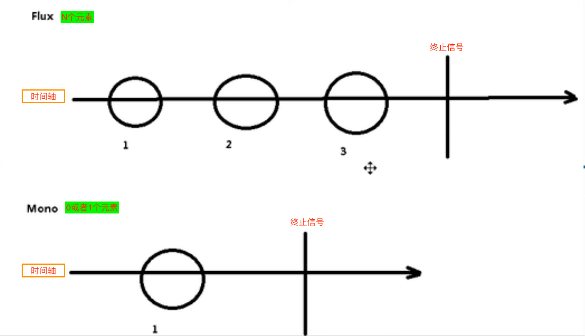

​	4）代码演示说明
​		第一步 引入依赖

```xml
<dependency>
  <groupId>io.projectreactor</groupId>
  <artifactId>reactor-core</artifactId>
</dependency>
```

​	第二步 流程代码

```java
package com.atguigu.spring5.webFlux.reactor.sample;

import reactor.core.publisher.Flux;
import reactor.core.publisher.Mono;

import java.util.Arrays;
import java.util.List;
import java.util.stream.Stream;

public class TestWebFluxReactor {

    public static void main(String[] args) {
        //just方法直接声明式
        Flux.just(1,2,3,4); // just方法可传可变参数
        Mono.just(1);

        //其他方法 - 数组声明方式
        Integer[] array = {1,2,3,4};
        Flux.fromArray(array);

        //其他方法 - 列表声明方式
        List<Integer> list = Arrays.asList(array);
        Flux.fromIterable(list);

        //其他方法 - 流声明方式
        Stream<Integer> stream = list.stream();
        Flux.fromStream(stream);
    }
}

```

​	5）三种信号相关特点
​		第一个：**错误信合和完成信号**都是终止信号，他们是**不能共存**的
​		第二个：如果没有发送任何元素值，而是直接发送错误或者完成信号，表示是**空数据流**
​		第三个：如果没有错误信号，也没有完成信号，表示是**无限数据流**
​	6）调用just或者其他方法只是声明数据流，数据流病没有发出，只有进行订阅之后才会触发数据流，不订阅什么都不会发生的。

```java
public class TestWebFluxReactor {

    public static void main(String[] args) {
        /**
         * 使用subscribe订阅才会触发数据流，不订阅什么都不会发生
         */
        //just方法直接声明式
        Flux.just(1,2,3,4).subscribe(System.out::println); // just方法可传可变参数
        Mono.just(1).subscribe(System.out::println);

        //其他方法 - 数组声明方式
        Integer[] array = {5,6,7};
        Flux.fromArray(array).subscribe(System.out::println);

        //其他方法 - 列表声明方式
        List<Integer> list = Arrays.asList(array);
        Flux.fromIterable(list).subscribe(System.out::println);

        //其他方法 - 流声明方式
        Stream<Integer> stream = list.stream();
        Flux.fromStream(stream).subscribe(System.out::println);


    }
}
```

​	7）操作符 
​		*对数据流进行一道道操作，称为操作符，比如工厂流水线
​		第一个操作符 map - 元素映射为新元素
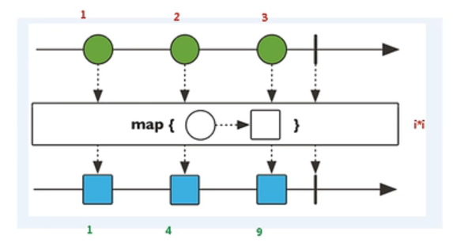
​		第二个操作符 flatMap - 元素映射为流。把每个元素转换成流，把转换之后多个流合并成大的流
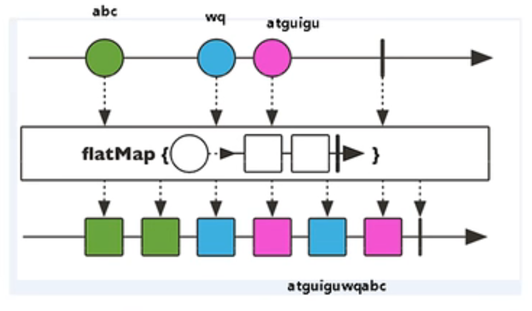

4、WebFlux原理（执行流程和核心API）
	SpringWebFlux基于Reactor，默认容器是Netty，**Netty是高性能的NIO框架**，异步非阻塞的框架
	1）Netty
		*BIO （Blocking I/O）概念
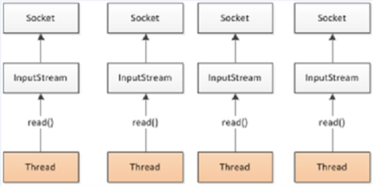
		*NIO（Non-blocking I/O）- Netty采用
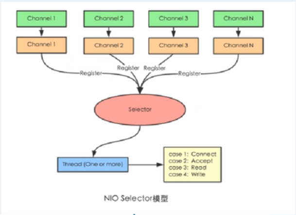
	2）SpringWebFlux执行过程和SpringMVC相似的
		*SpringWebFlux核心控制器DispatchHandler，实现接口WebHandler
		*接口**WebHandler**有一个**handle**方法
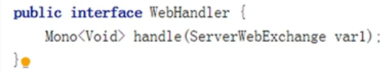

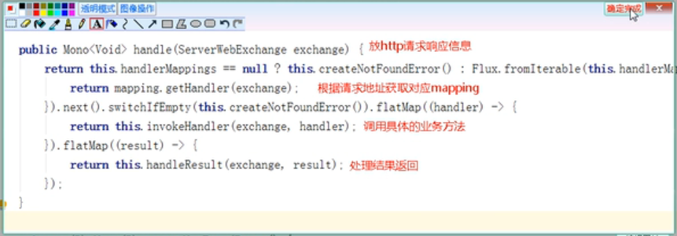
	3）SpringWebFlux里面DispatchHandler，负责请求的处理
		*HandlerMapping - 根据客户端请求，能够**查询处理请求的方法**
		*HandlerAdapter - 适配器效果，**真正负责请求处理**，实现的请求具体的业务方法
		*HandlerResultHandler - 负责**响应结果处理**
	4）SpringWebFlux实现函数式编程，两个接口：**RouterFunction（路由处理）**和**HandlerFunction（处理函数）**
		*RouterFunction - 实现路由功能，将请求转发给对应的handler
		*HandlerFunction - 处理请求并且响应函数的方法

5、SpringWebFlux（1/2 基于注解编程模型）
	SpringWebFlux实现方式有两种：**注解编程模型**和**函数式编程模型**
	使用注解编程模型方式，和SpringMVC使用很相似，只需要把相关依赖配置到项目中，SpringBoot自动配置相关运行容器，默认情况下使用Netty服务器
	第一步 创建SpringBoot工程，引入WebFlux依赖

```xml
<dependency>
  <groupId>org.springframework.boot</groupId>
  <artifactId>spring-boot-starter-webflux</artifactId>
</dependency>
```

​	第二步 配置启动端口号
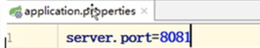
​	第三步 创建包和相关类

```java
//用户实体类
public class User {
  private String name;
  private String gender;
  private Integer age;

  public User(String name, String gender, Integer age) {
    this.name = name;
    this.gender = gender;
    this.age = age;
  }

  public String getName() {
    return name;
  }

  public void setName(String name) {
    this.name = name;
  }

  public String getGender() {
    return gender;
  }

  public void setGender(String gender) {
    this.gender = gender;
  }

  public Integer getAge() {
    return age;
  }

  public void setAge(Integer age) {
    this.age = age;
  }
}


//用户操作接口
public interface UserService {

  //根据id查询用户
  Mono<User> getUserById(int id);

  //查询所有用户
  Flux<User> getAllUser();

  //添加用户
  Mono<Void> saveUserInfo(Mono<User> user);
}


//用户操作接口实现类
@Component
public class UserServiceImpl implements UserService {

    //创建map集合存储数据（这里为了知识点学习方便，不从数据库造数据取出）
    private final Map<Integer, User> users = new HashMap<>();

    public UserServiceImpl() {
        this.users.put(1, new User("Lucy", "female", 20));
        this.users.put(2, new User("Mary", "female", 30));
        this.users.put(3, new User("Jack", "female", 50));
    }

    @Override
    public Mono<User> getUserById(int id) {
        return Mono.justOrEmpty(this.users.get(id));
    }

    @Override
    public Flux<User> getAllUser() {
        return Flux.fromIterable(this.users.values());
    }

    @Override
    public Mono<Void> saveUserInfo(Mono<User> userMono) {
        return userMono.doOnNext(person -> {
            //向map集合里面放值
            int id = users.size() + 1;
            users.put(id, person);
        }).thenEmpty(Mono.empty()); //清空Mono元素终止
    }
}


//创建controller
@RestController
public class UserController {

    //注入service
    @Autowired
    private UserService userService;

    //根据id查询用户
    @GetMapping("/user/{id}")
    public Mono<User> getUserById(@PathVariable int id) {
        return userService.getUserById(id);
    }

    //查询所有用户
    @GetMapping("/user")
    public Flux<User> getAllUser() {
        return userService.getAllUser();
    }

    //添加用户
    @PostMapping("/saveUser")
    public Mono<Void> saveUserInfo(@RequestBody User user) {
        Mono<User> userNew = Mono.just(user);
        return userService.saveUserInfo(userNew);
    }
}
```

​	执行SpringBoot Application启动类测试：

```java
@SpringBootApplication
public class Application {
    public static void main(String[] args) {
        SpringApplication.run(Application.class, args);
    }
}
```

​	根据id查询用户
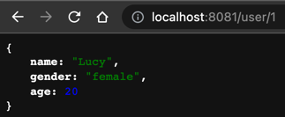
​	查询所有用户
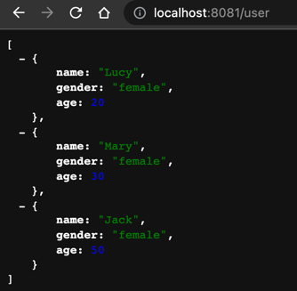
​	添加用户
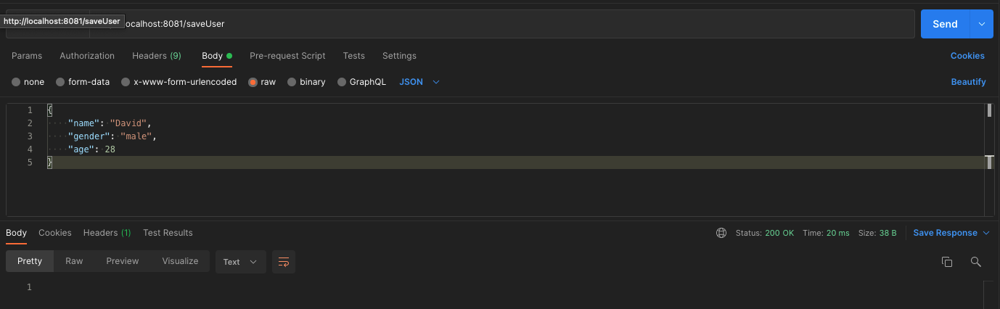
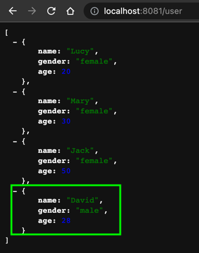

```bash
curl --location --request POST 'http://localhost:8081/saveUser' \
--header 'Content-Type: application/json' \
--data-raw '{
    "name": "David",
    "gender": "male",
    "age": 28
}'
```

总结：SpringWebFlux与SpringMVC编写方式差异不大，但底层实现完全不一样了。
***SpringMVC方式实现**：同步阻塞的方式，基于SpringMVC+Servlet+Tomcat
***SpringWebFlux方式实现**：异步非阻塞的方式，基于SpringWebFlux+Reactor+Netty

6、SpringWebFlux（2/2 基于函数式编程模型）