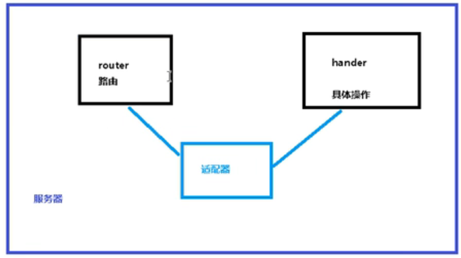

### Spring 5框架新功能（WebFlux）

（继续上一小节）

6、SpringWebFlux（2/2 基于**函数式编程模型**）
	1）在使用函数式编程模型操作的时候，需要自己初始化服务器
	2）在使用函数式编程模型操作的时候，有两个核心接口：**RouterFunction(实现路由功能，请求转发给对应的handler)**和**HandlerFunction(处理请求生成相应的函数)**。核心任务定义两个函数式接口的实现并且启动需要的服务器
	3）SpringWebFlux请求和响应不再是ServletRequest和ServletResponse，而是**ServerRequest**和**ServerResponse**。

	第一步 把注解编程模型工程复制一份再修改
	第二步 创建Handler（具体实现方法）

```java
public class UserHandler {

    private UserService userService;

    public UserHandler(UserService userService) {
        this.userService = userService;
    }

    //根据id查询用户
    public Mono<ServerResponse> getUserById(ServerRequest serverRequest) {
        //获取请求发过来的id值
        int id = Integer.parseInt(serverRequest.pathVariable("id"));

        //空值处理
        Mono<ServerResponse> notFound = ServerResponse.notFound().build();

        //调用service方法得到数据
        Mono<User> userMono = this.userService.getUserById(id);

        //把Mono<User> userMono进行转换返回，这里使用Reactor操作符flatMap对返回值进行处理
        return userMono
                .flatMap(person -> ServerResponse
                        .ok()
                        .contentType(MediaType.APPLICATION_JSON)
                        .body(fromObject(person)))
                .switchIfEmpty(notFound);
    }

    //查询所有用户
    public Mono<ServerResponse> getAllUser() {
        //调用service方法得到数据
        Flux<User> allUser = this.userService.getAllUser();

        //把Flux<User> allUser进行转换返回
        return ServerResponse.ok().contentType(MediaType.APPLICATION_JSON).body(allUser, User.class);
    }

    //添加用户
    public Mono<ServerResponse> saveUserInfo(ServerRequest serverRequest) {
        //获取请求发过来的User
        Mono<User> userMono = serverRequest.bodyToMono(User.class);

        //调用service方法得到数据，然后将该变化通过ServerResponse的build方法订阅
        return ServerResponse.ok().build(this.userService.saveUserInfo(userMono));
    }
}
```

​	第三步 初始化服务器，编写Router
​		*1 - 创建Router路由
​		*2 - 创建服务器完成适配
​		*3 - main方法最终调用

```java
public class Server {

    //3 - main方法最终调用
    public static void main(String[] args) throws IOException {
        Server server = new Server();
        server.createReactorServer();
        System.out.println("Enter to exit");
        System.in.read();
    }

    //1 创建Router路由
    public RouterFunction<ServerResponse> routingFunction() {
        //创建handler对象
        UserService userService = new UserServiceImpl();
        UserHandler handler = new UserHandler(userService);

        //设置路由
        return RouterFunctions
                .route(RequestPredicates.GET("/user/{id}").and(RequestPredicates.accept(MediaType.APPLICATION_JSON)), handler::getUserById)
                .andRoute(RequestPredicates.GET("/user").and(RequestPredicates.accept(MediaType.APPLICATION_JSON)), handler::getAllUser);
    }

    //2 创建服务器完成适配
    public void createReactorServer() {
        //路由和handler适配
        RouterFunction<ServerResponse> route = this.routingFunction();
        HttpHandler httpHandler = toHttpHandler(route);

        //创建适配器
        ReactorHttpHandlerAdapter reactorHttpHandlerAdapter = new ReactorHttpHandlerAdapter(httpHandler);

        //创建服务器
        HttpServer httpServer = HttpServer.create();
        httpServer.handle(reactorHttpHandlerAdapter).bindNow();
    }
}
```

​	第四步 测试，运行main方法启动服务器，看log生成的动态端口访问服务


