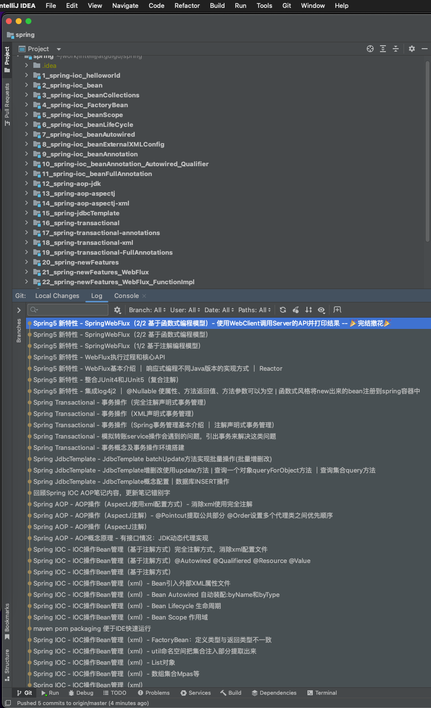

## Spring学习内容总结

该代码基于学习哔哩哔哩[尚硅谷Spring框架视频教程](https://www.bilibili.com/video/BV1Vf4y127N5)，使用maven管理依赖，省去jar包管理，大体目录结构内容如下。每一小节的笔记都在相应目录内的README.md文件里。

### 课程内容介绍

1、Spring框架概述
	1）轻量级开元JavaEE框架，为了解决企业复杂性，两个核心组成：IOC和AOP
	2）Spring5.2.6版本

2、IOC容器
	1）**IOC底层原理（工厂、反射等）**
	2）IOC接口（BeanFactory）
	3）**IOC操作Bean管理（基于xml）**
	4）**IOC操作Bean管理（基于注解）**

3、AOP
	1）**AOP底层原理：动态代理**，有接口（JDK动态代理），没有接口（CGLIB动态代理）
	2）**术语：切入点、增强（通知）、切面**
	3）**基于AspectJ实现AOP操作**

4、JdbcTemplate
	1）**使用JdbcTemplate实现对数据库的CRUD操作**
	2）**使用JdbcTemplate实现对数据库批量操作**

5、事务管理
	1）**事务概念**
	2）**重要概念（传播行为和隔离级别）**
	3）**基于注解实现声明式事务管理 - *重点掌握**
	4）**完全注解方式实现声明式事务管理**

6、Spring5新特性
	1）**整合日志框架log4j2**
	2）**@Nullable注解**
	3）**函数式注册对象**
	4）**整合JUnit5单元测试框架**
	5）**SpringWebFlux使用**

